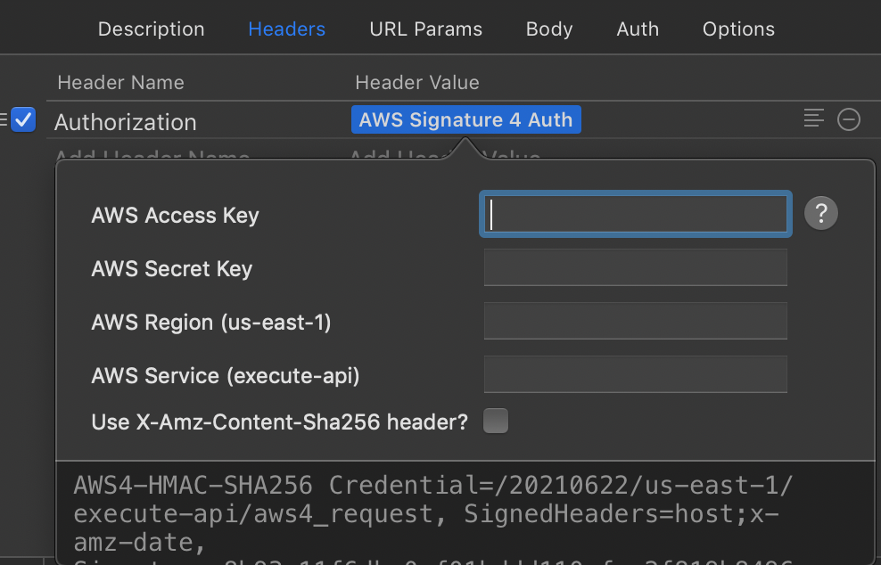

# AWS Signature 4 Auth Dynamic Value (Paw Extension)

A [Paw Extension][extensions] to compute AWS Signature version 4 authentication signatures for the accessing the main AWS services including REST APIs build using AWS API Gateway that are protected using IAM.

## Installation

To install AWS Signature 4 authentication go to the [Paw Extension page][extension] and click the "Install Extension" button.

For each request, add a header `Authorization` and set the value to this extension (start typing "AWS" and select AWS Signature 4 or right-click on the value and choose **Extensions > AWS Signature 4**). Enter your credentials by clicking on the dynamic value extension. The AWS Access and Secret keys are required. If you leave the other fields blank they will use defaults.
        

    
Add a second header `X-Amz-Date`. Set the value to custom timestamp (start typing "timestamp" and select the Custom formatting timestamp option or right click the value and select **Timestamp > Custom formatting**). Enter a custom timestamp format by clicking on the dynamic value extension, and selecting `Custom formatting` from the format. Enter the value `%G%m%dT%H%M%SZ` for the format. Make sure `Now` is checked, delta is 0, and `local time` is unchecked. AWS requires the time be within a few seconds of server time in UTC (not local time).


If you don't have something to test against, follow the [Getting Started][start] guide for the API Gateway service to create a basic "hello world" API. Make sure that the API is [protected by IAM security][protect] by choosing "authorization type" of `AWS IAM` in the console when configuring the method.

This extension was developed to test in-house API Gateway REST APIs. However, AWS Signature 4 is used to protect all the standard AWS service endpoints. By ensuring you have the correct `aws service` setting for the extension you can manually call any of the AWS service endpoints using Paw.

> Note: if you are a user of STS temporary credentials, you will also need a header `X-Amz-Security-Token` with your `session token`.

# Issues

* Freeze dynamic values to obtain X-Amz-Date as generated and sent to client (will help with debugging and eliminates an edge case where the AWS signature can be generated in a different second than the X-Amz-Date).
* Need binary a version of HMAC SHA256 crypto function. Currently, the extension uses CryptJS which is fairly slow.

## Development

Edit source javascript file and run the following to install in Paw.

```shell
make install
```

Note: if you installed Paw using Setapp you will need to modify the Makefile to include the setapp specific container name (com.luckymarmot.Paw-setapp).

## License

This Paw Extension is licensed under the [MIT License](LICENSE). Feel free to fork, and modify!

## Contributors

See [Contributors][contributors].

[extensions]: http://luckymarmot.com/paw/extensions/
[extension]: https://paw.cloud/extensions/AWSSignature4DynamicValue
[contributors]: https://github.com/luckymarmot/Paw-AWSSignature4DynamicValue/graphs/contributors
[start]: http://docs.aws.amazon.com/apigateway/latest/developerguide/getting-started.html
[protect]: http://docs.aws.amazon.com/apigateway/latest/developerguide/how-to-method-settings-callers-console.html
